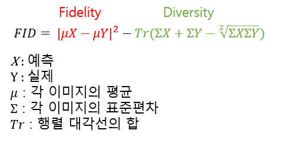

본 포스팅은 지난 포스팅에 이어 작성되었습니다.

* [성능 평가 지표 (1)](https://epozen-dt.github.io/model-evaluation-metrics1/)

---
&nbsp;

> ## FID(Frechet Inception Distance)란?

&nbsp;

FID는 생성모델에서 생성된 이미지의 품질을 평가하는 지표로, 실제와 예측의 차이를 구하여 판단합니다. 초기에 사용하던 평가 지표인 IS(Inception Score)는 생성된 이미지의 분포만 반영을 했는데, FID는 생성한 이미지의 분포도 같이 반영을 합니다. FID는 2017년에 처음 소개되었으며, 이미지의 화질과 다양성을 고려하여 품질 정도를 나타냅니다. FID는 wesserstein-2 계산 방식[[3]](https://www.slideshare.net/ssuser7e10e4/wasserstein-gan-i)을 따르고, 연산 결과가 낮을수록 좋은 성능을 가지는 모델입니다[[1]](https://en.wikipedia.org/wiki/Fr%C3%A9chet_inception_distance). 

&nbsp;

> ## 값 구하는 순서

이미지의 FID 점수를 구하는 과정은 다음과 같습니다 (논문 참고[[2]](https://arxiv.org/abs/1706.08500)).

    1. InceptionV3 모델에 이미지를 입력 : 이미지를 저차원으로 변경
    2. FC층 직전의 feture map 추출 : 풀링 레이어를 통과한 이미지는 벡터화되는데 이를 이용할 예정
    3. 각 이미지의 평균과 표준편차를 구함.
    4. 공식에 각 값을 넣어 FID 값을 구함.

&nbsp;

> ## 사용한 코드

&nbsp;

코드는 해당 사이트를 참고하였습니다[[4]](https://github.com/mseitzer/pytorch-fid/blob/master/src/pytorch_fid/fid_score.py).

    def calculate_fretchet(images_real,images_fake,model):
     mu_1,std_1=calculate_activation_statistics(images_real,model,cuda=True)
     mu_2,std_2=calculate_activation_statistics(images_fake,model,cuda=True)

     """get fretched distance"""
     fid_value = calculate_frechet_distance(mu_1, std_1, mu_2, std_2)
     return fid_value

    
    def calculate_activation_statistics(images,model,batch_size=4, dims=2048, cuda=False):

        model.eval()
        act=np.empty((len(images), dims))

        if cuda:
            batch=images.cuda()
        else:
            batch=images
        pred = model(batch)[0]

            # If model output is not scalar, apply global spatial average pooling.
            # This happens if you choose a dimensionality not equal 2048.
        if pred.size(2) != 1 or pred.size(3) != 1:
            pred = adaptive_avg_pool2d(pred, output_size=(1, 1))

        act= pred.cpu().data.numpy().reshape(pred.size(0), -1)

        mu = np.mean(act, axis=0)
        sigma = np.cov(act, rowvar=False)
        return mu, sigma

    def calculate_frechet_distance(mu1, sigma1, mu2, sigma2, eps=1e-6):
    """Numpy implementation of the Frechet Distance.
    The Frechet distance between two multivariate Gaussians X_1 ~ N(mu_1, C_1)
    and X_2 ~ N(mu_2, C_2) is
            d^2 = ||mu_1 - mu_2||^2 + Tr(C_1 + C_2 - 2*sqrt(C_1*C_2)).
    """

    mu1 = np.atleast_1d(mu1)
    mu2 = np.atleast_1d(mu2)

    sigma1 = np.atleast_2d(sigma1)
    sigma2 = np.atleast_2d(sigma2)

    assert mu1.shape == mu2.shape, \
        'Training and test mean vectors have different lengths'
    assert sigma1.shape == sigma2.shape, \
        'Training and test covariances have different dimensions'

    diff = mu1 - mu2

    covmean, _ = linalg.sqrtm(sigma1.dot(sigma2), disp=False)
    if not np.isfinite(covmean).all():
        msg = ('fid calculation produces singular product; '
               'adding %s to diagonal of cov estimates') % eps
        print(msg)
        offset = np.eye(sigma1.shape[0]) * eps
        covmean = linalg.sqrtm((sigma1 + offset).dot(sigma2 + offset))

    if np.iscomplexobj(covmean):
        if not np.allclose(np.diagonal(covmean).imag, 0, atol=1e-3):
            m = np.max(np.abs(covmean.imag))
            raise ValueError('Imaginary component {}'.format(m))
        covmean = covmean.real

    tr_covmean = np.trace(covmean)

    return (diff.dot(diff) + np.trace(sigma1) +
            np.trace(sigma2) - 2 * tr_covmean)

    fid_score = calculate_fretchet(outputs, fake, model)

&nbsp;

이외에도 그래프를 이용한 AUC(Area Under Curve), CNN 계열 모델에서 자주 쓰이는 정확도, 정밀도, 재현율 F-1 Score 등이 있습니다. 

&nbsp;

------
> 참고

[1] [FID 설명](https://en.wikipedia.org/wiki/Fr%C3%A9chet_inception_distance)

[2] [FID 논문](https://arxiv.org/abs/1706.08500)

[3] [Wasserstein-2 이해](https://www.slideshare.net/ssuser7e10e4/wasserstein-gan-i)

[4] [사용한 코드](https://github.com/mseitzer/pytorch-fid/blob/master/src/pytorch_fid/fid_score.py)