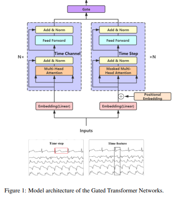
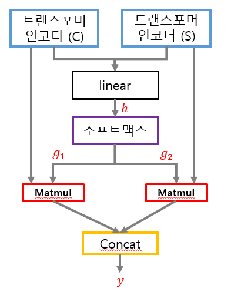

본 포스팅은 GTN(Gated Transformer Network)에 대한 내용입니다.

---

> ## GTN?

GTN(Gated Transformer Network)는 트랜스포머의 인코더 두 개를 사용하여 channel-wise와 step-wise 특징을 각각 추출하여 사용하는 모델로, 다음과 같은 특징이 있습니다.

    - 다변량 시계열 데이터 분류에 트랜스포머 모델이 효과적임
    - 저자는 트랜스포머를 변형하면 성능이 향상될 것이라 예상
    - 기존 트랜스포머에서 변형된 점
        1. 디코더X, 인코더 2개 : 채널 별(전역적), 스텝 별(지역적) 정보 각각 추출
        2. 게이트 가중치 추가 : 두 개의 인코더 출력 값 중 더 중요한 정보를 택함
    - 장점 : channel과 step 모두 고려하기 때문에 더 세밀하게 특징을 추출할 수 있고, 모델의 확장성을 증명했다
    - 단점 : 선형 데이터만 처리 가능

&nbsp;

GTN 전체 구조는 하단 그림에서 확인할 수 있습니다.

&nbsp;

* ### Embedding

언어 데이터를 사용할 때 트랜스포머 모델에서의 임베딩은 단어를 토큰화하여 입력으로 사용하는데 이를 one-hot 인코딩으로 변환하는 과정이 필요합니다. 이렇게 생성한 토큰에 가중치를 적용하기 위해 내적을 이용합니다.  하지만 시계열 데이터는 연속성을 가지기 때문에 변환 과정이 필요하지않습니다. 따라서 저자는  Fully Connected layer를 사용했습니다. 

&nbsp;

* ### Gate

Gate(전체 구조에서 진한 보라색 층)의 구조는 다음과 같습니다. 

두 인코더의 출력 값을 연결하여 얻은 h를 소프트맥스 함수를 통과시킵니다. 소프트맥스의 결과 값(g1,g2)을 인코더의 출력 값과 내적합니다. 내적 결과에서 채널과 스텝 중 더  높은 값이 나온 쪽의 정보를 활용하게 됩니다. 다시 말해, 소프트맥스 결과 값이 인코더 정보의 활용 여부를 결정하는 게이트 역할을 하는 것입니다.

    <게이트>
    h = W*concat(C,S)+b
    g1, g2 = softmax(h)
    y = concat(C*g1, S*g2)

&nbsp;

확률적으로 더 좋은 정보를 추출하기 위한 방법으로는 좋다고 생각합니다. 다만, 선형으로 이어놓았기 때문에 합성곱을 사용하는 다른 모델들과 성능 차이가 거의 없고, 데이터세트에 따라 낮은 성능을 보이기도 해서 구조를 변형하여 사용하는 것이 좋습니다.

------
> 참고

[1] [논문](https://arxiv.org/abs/2103.14438)

[2] [그림](https://greeksharifa.github.io/paper_review/2022/08/31/gated-transformer/)