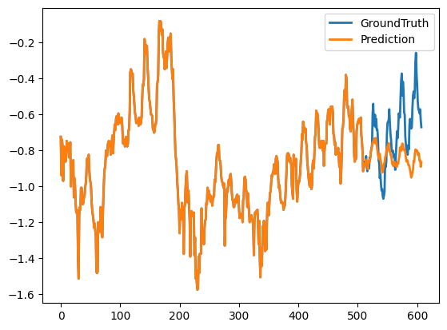

본 포스팅은 PatchTST 벤치마크 결과에 대한 내용입니다.

---
&nbsp;

> ## PatchTST 벤치마크 코드 (Google Colab)
  저번 PatchTST의 이론적인 설명을 기반으로하여 모델을 구현 및 학습을 통해 성능 결과와 시각화를 출력해보겠습니다.
&nbsp;

    !git clone https://github.com/yuqinie98/PatchTST.git
    !git clone https://github.com/zhouhaoyi/ETDataset.git
    !ls

    import sys
    if not 'PatchTST' in sys.path:
    sys.path += ['PatchTST']
    sys.path

    from utils.tools import dotdict
    from exp.exp_main import Exp_Main
    import torch

    args = dotdict()

    # 모델과 데이터셋 설정
    args.model_id = 'test'
    args.model_name = 'PatchTST'
    args.data = 'ETTh1'
    args.root_path = '/content/ETDataset/ETT-small/'
    args.data_path = 'ETTh1.csv'
    args.features = 'M'
    args.target = 'OT'
    args.freq = 'h'
    args.checkpoints = '/content/checkpoints'
    args.is_training = 1
    # 학습 설정
    args.random_seed = 2021
    args.seq_len = 512
    args.label_len = 0
    args.pred_len = 96
    
    # former 모델 구조 설정
    args.model = 'PatchTST'
    args.embed_type = 0
    args.enc_in = 7
    args.dec_in = 7
    args.c_out = 7
    args.n_heads = 4
    args.d_model = 128
    args.e_layers = 10
    args.d_layers= 2
    args.d_ff = 128
    args.moving_avg = 100
    args.factor = 1
    args.distill = True
    args.dropout = 0.3
    args.embed = 'timeF'
    args.activation = 'gelu'
    args.output_attention = True
    args.do_predict = True
    
    # PatchTST 모델 구조 설정
    args.fc_dropout = 0.3
    args.head_dropout = 0.5
    args.patch_len = 16
    args.stride = 8
    args.padding_patch = 'end'
    args.revin = 1
    args.affine = 0
    args.subtract_last = 0
    args.decomposition = 1
    args.kernel_size = 25
    args.individual = 0
    args.store_attn=True
    
    # 학습 과정 설정
    args.train_epochs = 100
    args.itr = 1
    args.batch_size = 128
    args.learning_rate = 0.0001
    args.num_workers = 30
    args.pct_start = 0.3
    args.use_amp = False
    args.des = 'Exp'
    args.loss = 'mse'
    args.lradj = 'type3'
    args.patience = 30
    
    # GPU
    args.use_gpu = True
    args.gpu = 0
    args.devices = '0'
    args.use_multi_gpu = False

    args.use_gpu = True if torch.cuda.is_available() and args.use_gpu else False
    
    if args.use_gpu and args.use_multi_gpu:
    args.devices = args.devices.replace(' ','')
    device_ids = args.devices.split(',')
    args.device_ids = [int(id_) for id_ in device_ids]
    args.gpu = args.device_ids[0]

    args.detail_freq = args.freq
    args.freq = args.freq[-1:]

    print('Args in experiment:')
    print(args)

    Exp = Exp_Main

    if args.is_training:
    for ii in range(args.itr):
    # setting record of experiments
    setting = '{}_{}_{}_ft{}_sl{}_ll{}_pl{}_dm{}_nh{}_el{}_dl{}_df{}_fc{}_eb{}_dt{}_{}_{}'.format(
    args.model_id,
    args.model,
    args.data,
    args.features,
    args.seq_len,
    args.label_len,
    args.pred_len,
    args.d_model,
    args.n_heads,
    args.e_layers,
    args.d_layers,
    args.d_ff,
    args.factor,
    args.embed,
    args.distil,
    args.des,ii,)

      exp = Exp(args)  # set experiments
      print('>>>>>>>start training : {}>>>>>>>>>>>>>>>>>>>>>>>>>>'.format(setting))
      exp.train(setting)

      print('>>>>>>>testing : {}<<<<<<<<<<<<<<<<<<<<<<<<<<<<<<<<<'.format(setting))
      exp.test(setting)

      if args.do_predict:
          print('>>>>>>>predicting : {}<<<<<<<<<<<<<<<<<<<<<<<<<<<<<<<<<'.format(setting))
          exp.predict(setting, True)

      torch.cuda.empty_cache()
      else:
      ii = 0
      setting = '{}_{}_{}_ft{}_sl{}_ll{}_pl{}_dm{}_nh{}_el{}_dl{}_df{}_fc{}_eb{}_dt{}_{}_{}'.format(args.model_id,
      args.model,
      args.data,
      args.features,
      args.seq_len,
      args.label_len,
      args.pred_len,
      args.d_model,
      args.n_heads,
      args.e_layers,
      args.d_layers,
      args.d_ff,
      args.factor,
      args.embed,
      args.distil,
      args.des, ii)
      

    exp = Exp(args)  # set experiments
    exp = Exp(args)  # set experiments
    print('>>>>>>>testing : {}<<<<<<<<<<<<<<<<<<<<<<<<<<<<<<<<<'.format(setting))
    exp.test(setting, test=1)
    torch.cuda.empty_cache()

> ##  모델 테스트 성능 결과 및 시각화
&nbsp;

모델의 성능 지표는 MAE와 MSE로 측정되며 다음과 같이 성능을 증명하였습니다. 
mse:0.4166485071182251, mae:0.43856024742126465

학습이 끝난 모델의 테스트 결과를 시각화 합니다.
시각화 코드는 PatchTST 내부적으로 코드가 작성되어있어 학습이 끝나면 자동적으로 결과를 저장합니다.

----
    
&nbsp;

> 참고 문서

[1] [깃허브](https://github.com/yuqinie98/PatchTST/blob/main/PatchTST_supervised/run_longExp.py)

